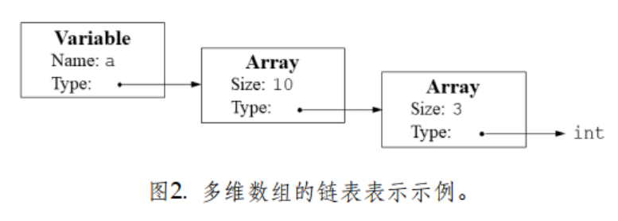
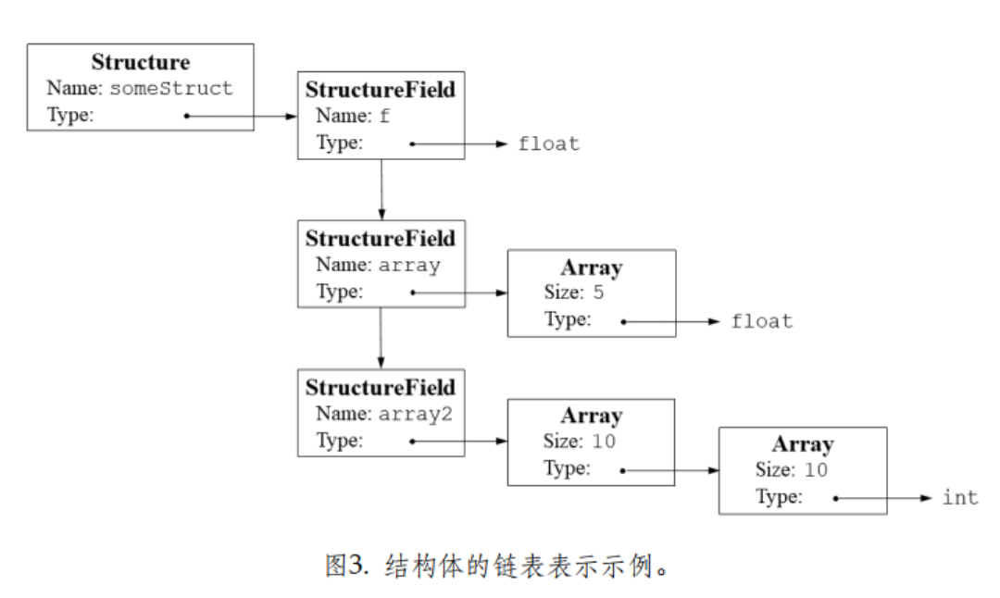

# 文件结构
|- code: 在词法分析和语法分析的基础上进行语义分析，可以直接使用`./make.sh`进行编译
    |- tree.c: 语法树构建代码
    |- semantic.c: 语义分析相关的实现
    |- syntax.y: 语法分析代码，使用bison实现，使用`bison -d syntax.y`编译
    |- lexical.l: 词法分析代码，使用flex实现
    |- main.c: 主程序，使用`gcc main.c syntax.tab.c -lfl -ly -o parser`编译
|- test：测试文件

# 详细说明
## 类型表示
1. 每个值都会有一个类型 
2. 用于表示基本类型（int、float）、数组及多维数组、结构体
3. 具体见`semantic.h`中的`Type`
4. 多维数组和结构体都是用FieldList进行连接的，每个FieldList都连接了下一个域，并绑定了type
    1. 多维数组链表表示：
    2. 结构体链表表示：

# 编译与测试
1. 编译
    ```
    ./bison/make.sh
    ```
2. 测试
    ```
    # 单次测试
    ./test/test_bison.sh

    # 测试所有
    ./test/test_bison_all.sh
    ```

# 结果
1. 